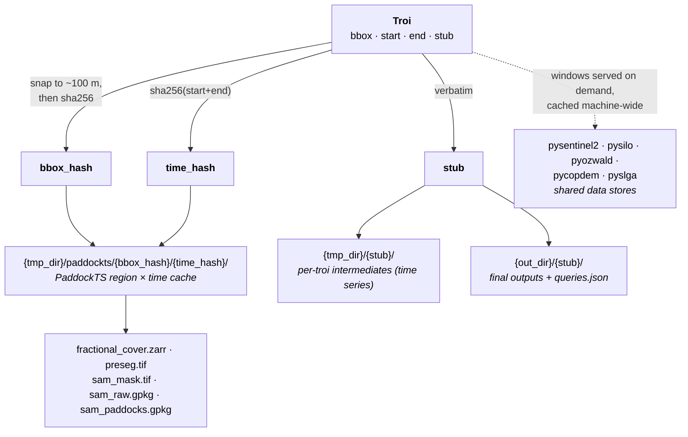

# Troi & Config

The `Troi` (Time and Region Of Interest) is the immutable, content-addressed object that flows
through every stage of the pipeline. A `Troi` describes a region
(bounding box, EPSG:4326) and a time window; every stage derives its
input and output paths from it.

The `Config` controls global behavior — where outputs go, where caches
live, and credentials for the SILO and SLGA stages. A `Config` is
attached to every `Troi` (defaulting to the one loaded from
`~/.config/Troi.json`, or built-in defaults if that file is
absent).

---

## Key ideas

- **Content addressing.** If you don't pass a `stub`, it's computed as
  `sha256(bbox + start + end)` so two queries with identical inputs
  share outputs on disk.
- **Region identity.** Bounding boxes are snapped to ~100 m precision
  (3 decimal places) before hashing into `bbox_hash`, so near-identical
  bboxes share one region identity. `bbox_hash` keys the registry and
  the PaddockTS region × time cache; the data stores dedup at their own
  finer granularity (grid chunks / points) regardless.
- **Registry.** Every constructed `Troi` is recorded in
  `{config.out_dir}/queries.json` under its `bbox_hash`. Reusing a
  `stub` for a different `(bbox, start, end)` raises `ValueError`.
- **Derived paths live elsewhere.** `Troi` carries no storage layout:
  input data (Sentinel-2, climate, terrain, soils) is cached by the
  machine-wide stores, and PaddockTS's own artifacts (fractional cover,
  SAM paddocks, …) live on `PaddockTS.paths.Paths`, keyed by the
  Troi's identity hashes.

The diagram below shows how the four inputs fan out. Input data never
lives per-troi: the machine-wide stores (pysentinel2, pysilo,
pyozwald, pycopdem, pyslga) cache it once per machine at chunk/point
granularity. `bbox_hash × time_hash` keys only PaddockTS's own derived
artifacts, and the human-readable `stub` names the per-troi scratch
and final-output directories.



---

## Construct a `Troi`

### From a bounding box

```python
from datetime import date
from troi.troi import Troi

q = Troi(
    bbox=[148.36265, -33.52606, 148.38265, -33.50606],  # [W, S, E, N]
    start=date(2020, 1, 1),
    end=date(2021, 12, 31),
    stub="my_first_run",
)

print(q.out_dir)
# ~/Documents/Troi-Outputs/my_first_run
```

### From a centre point + buffer in km

```python
q = Troi.from_lat_lon(
    lat=-35.098087,
    lon=148.929983,
    buffer_km=2.0,       # ~ 4 km × 4 km AOI
    start=date(2025, 1, 1),
    end=date(2025, 6, 30),
    stub="point_buffered",
)
```

### From an existing paddocks file

```python
q = Troi.build_from_paddocks(
    paddocks_filepath="/path/to/paddocks.gpkg",
    start=date(2024, 1, 1),
    end=date(2024, 12, 31),
    stub="my_farm",
    label_col="paddock_name",
)
```

Reads the file (`.gpkg`, `.shp`, `.geojson`, or `.json`), reprojects to
EPSG:4326 if needed, takes the envelope of all features as the bbox,
and optionally renames `label_col` → `"paddock"` for downstream
compatibility.

---

## Custom config

The default `Config` reads from `~/.config/Troi.json` if present,
otherwise uses `~/Documents/Troi-Outputs` and
`~/Downloads/Troi-Tmp`. Override per-Troi by passing a `Config`
explicitly:

```python
from troi.config import Config
from troi.troi import Troi

cfg = Config(
    out_dir="/data/paddockts/outputs",
    tmp_dir="/data/paddockts/tmp",
    email="you@example.org",          # required for SILO
    tern_api_key="<your-tern-key>",   # required for SLGA
)

q = Troi(
    bbox=[148.36265, -33.52606, 148.38265, -33.50606],
    start=date(2020, 1, 1),
    end=date(2021, 12, 31),
    stub="my_run",
    config=cfg,
)
```

---

## `Troi` reference

The generic core (`bbox`, dates, `stub`, cache directories, registry,
alternate constructors) lives in the shared
[`troi`](https://github.com/thestochasticman/troi)
package; `troi.troi.Troi` subclasses it to add the
Sentinel-2 / SAM output paths.

::: troi.troi
    options:
      inherited_members: true

---

## `Config` reference

::: troi.config
