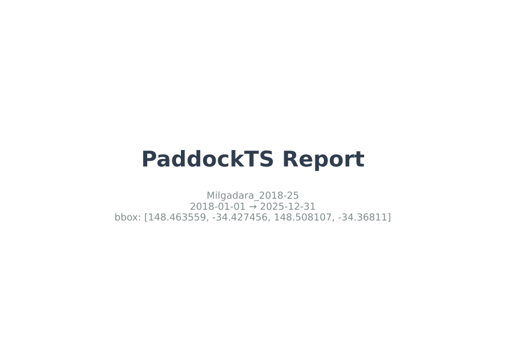
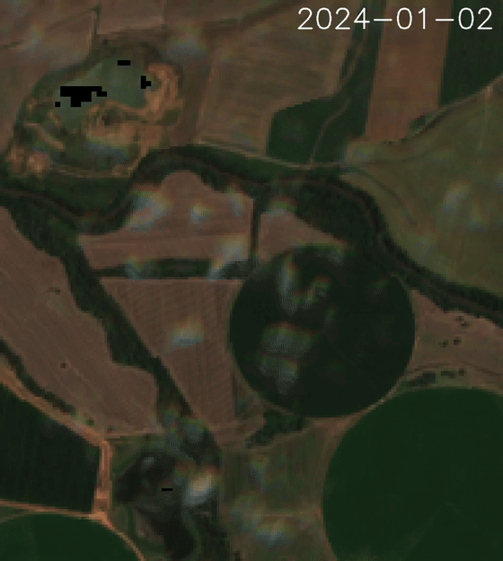
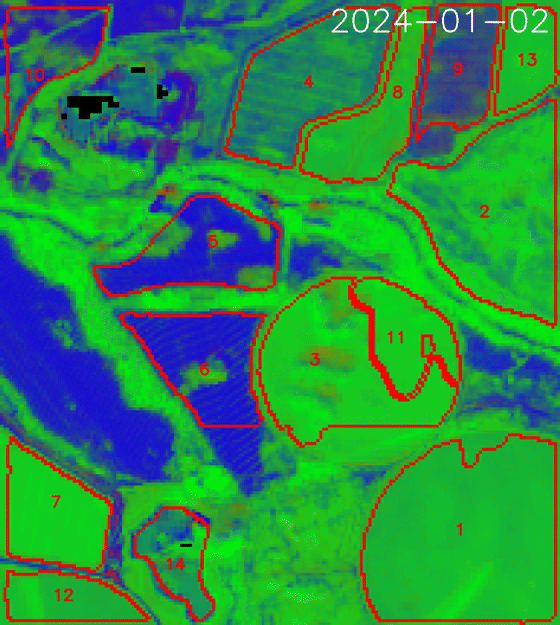
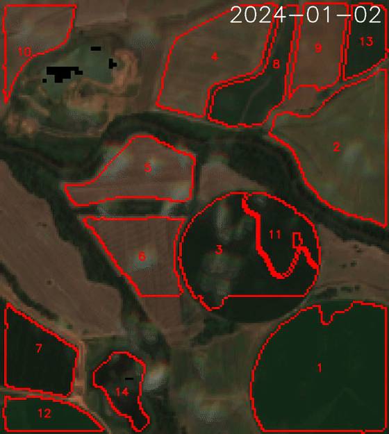
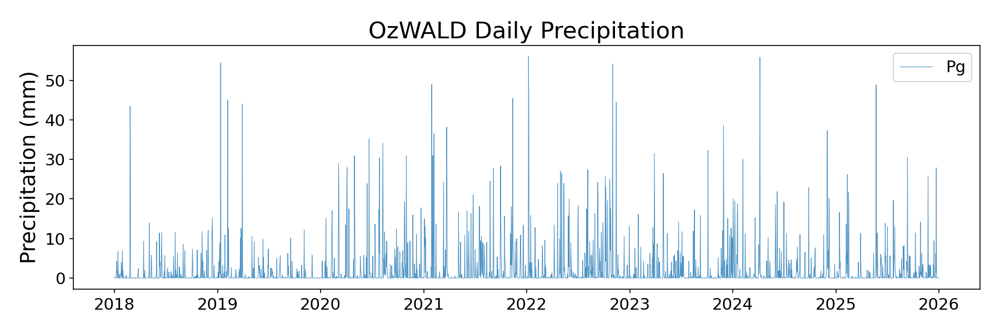

# Getting started

This page takes you from a fresh checkout to a first paddock-scale
analysis. It covers installation, configuration, constructing a `Troi`,
running the full pipeline, and the layout of the outputs on disk.

## Requirements

- **Python ≥ 3.11** (3.11 or 3.12 recommended).
- **Operating system:** Linux, macOS, or WSL. Native Windows is
  untested — the geospatial stack (GDAL, PROJ, GEOS) is much easier to
  set up under conda on a POSIX environment.
- **Disk:** ~3 GB for a single year over ~5 km² (Sentinel-2 zarr +
  intermediate masks). Add ~2.5 GB for the SAM ViT-H checkpoint on
  first segmentation run.
- **Memory:** 8 GB minimum, 16 GB+ recommended for AOIs above a few
  square km. SAM on CPU peaks at ~6 GB.
- **GPU (optional):** SAM segmentation auto-detects CUDA; everything
  else is CPU.
- **`ffmpeg`** with the `libopenh264` encoder for the MP4 outputs
  (installed by `environment.yml`).

## Install

### Conda + pip (recommended)

The conda environment provides the native and ML stack (GDAL, PROJ,
GEOS, PyTorch, TensorFlow, Segment Anything, ffmpeg); `pip install .`
then pulls the lab packages — the shared
[`troi`](https://github.com/thestochasticman/troi) core (the `Troi` /
`Config` primitives) and the five machine-wide data stores
([`pysentinel2`](https://github.com/thestochasticman/pysentinel2),
[`pysilo`](https://github.com/thestochasticman/pysilo),
[`pyozwald`](https://github.com/thestochasticman/pyozwald),
[`pycopdem`](https://github.com/thestochasticman/pycopdem),
[`pyslga`](https://github.com/thestochasticman/pyslga)) — from PyPI,
pinned to the releases tested with this version:

```bash
git clone https://github.com/johnburley3000/paddocktimeseries.git
cd paddocktimeseries
conda env update -n paddockts -f environment.yml   # creates the env if missing
conda activate paddockts
pip install .
```

### From source (development)

To hack on the lab packages themselves, clone them alongside and
install everything editable (`--no-deps` stops pip re-fetching the git
pins over your local checkouts):

```bash
git clone https://github.com/thestochasticman/troi.git
git clone https://github.com/thestochasticman/pysentinel2.git
# ... and the other stores you plan to touch
git clone https://github.com/johnburley3000/paddocktimeseries.git
cd paddocktimeseries
conda env update -n paddockts -f environment.yml
conda activate paddockts
pip install --no-deps -e ../troi -e ../pysentinel2 -e .
```

Confirm the install:

```bash
python -c "from troi.troi import Troi; print(Troi.__module__)"
# -> troi.troi
```

## Configure

PaddockTS reads optional configuration from `~/.config/Troi.json`.
Defaults are sensible for a single-user laptop, so this step is
optional — only the SILO and SLGA stages require credentials.

| Setting | Default | Required for |
|---|---|---|
| `out_dir` | `~/Documents/Troi-Outputs` | final outputs |
| `tmp_dir` | `~/Downloads/Troi-Tmp` | intermediates + caches |
| `email` | unset | SILO climate stage |
| `tern_api_key` | unset | SLGA soils stage |

Example `~/.config/Troi.json`:

```json
{
  "out_dir": "/data/paddockts/outputs",
  "tmp_dir": "/data/paddockts/tmp",
  "email": "you@example.org",
  "tern_api_key": "<your-tern-key>"
}
```

Settings can also come from environment variables
(`TROI_OUTDIR`, `TROI_TMPDIR`, `TROI_EMAIL`,
`TROI_TERN_KEY`).

- **SILO email** is registered with the upstream service; any working
  address is fine.
- **TERN API key** is generated at <https://account.tern.org.au/>.

The Sentinel-2 → PaddockTS chain itself works without any credentials.

### Pass a custom config from code

If you'd rather not write to `~/.config`, build a `Config` and pass it
to your `Troi`:

```python
from datetime import date
from troi.config import Config
from troi.troi import Troi

cfg = Config(
    out_dir="/data/paddockts/outputs",
    tmp_dir="/data/paddockts/tmp",
    email="you@example.org",
    tern_api_key="<your-tern-key>",
)

troi = Troi(
    bbox=[148.36265, -33.52606, 148.38265, -33.50606],
    start=date(2020, 1, 1),
    end=date(2021, 12, 31),
    stub="my_run",
    config=cfg,
)
```

## Construct a `Troi`

`Troi` is the immutable, content-addressed object that flows through
every stage. There are three ways to build one.

### From a bounding box

```python
from datetime import date
from troi.troi import Troi

troi = Troi(
    bbox=[148.36265, -33.52606, 148.38265, -33.50606],  # [W, S, E, N]
    start=date(2020, 1, 1),
    end=date(2021, 12, 31),
    stub="my_first_run",
)
```

Bounding boxes are `[west, south, east, north]` in EPSG:4326 (decimal
degrees). Snapped to 3 dp internally (~100 m) so near-identical bboxes
share their downloaded Sentinel-2 cube.

### From a centre point + buffer in km

```python
troi = Troi.from_lat_lon(
    lat=-35.098087,
    lon=148.929983,
    buffer_km=2.0,            # ±2 km from centre on each axis (≈ 4×4 km AOI)
    start=date(2025, 1, 1),
    end=date(2025, 6, 30),
    stub="point_buffered",
)
```

### From an existing paddocks file

If you already have field boundaries (GeoPackage, Shapefile, or GeoJSON):

```python
troi = Troi.build_from_paddocks(
    paddocks_filepath="/path/to/paddocks.gpkg",
    start=date(2024, 1, 1),
    end=date(2024, 12, 31),
    stub="my_farm",
    label_col="paddock_name",   # column with human-readable IDs
)
```

The bbox is the envelope of all geometries (reprojected to EPSG:4326).

### About the `stub`

If you omit `stub`, a SHA-256 hash of `(bbox, start, end)` is used —
two queries with identical inputs share outputs on disk. Pass an
explicit string for human-readable filenames. Stubs are registered in
`{config.hash_file}` and must uniquely identify a `Troi`; reusing a
stub for a different `(bbox, start, end)` raises `ValueError`.

## Run the pipeline

### Full run

The simplest entry point is `get_outputs`, which spawns the Sentinel-2
and environmental pipelines on parallel threads and shows a live
dashboard:

```python
from PaddockTS.get_outputs import get_outputs

get_outputs(troi)
```

Common options:

```python
get_outputs(troi, reload=True)        # delete tmp_dir + out_dir, then rerun
get_outputs(troi, show_log=True)      # render a tail-of-log panel
get_outputs(                           # skip SAM, use user-provided paddocks
    troi,
    paddocks_filepath="/path/to/paddocks.gpkg",
    skip_sam=True,
    label_col="paddock_name",
)
```

### Single stage

Every stage is a plain function. Call it directly when you want one
output and don't need the dashboard:

```python
from pysentinel2.cube import Cube
from PaddockTS.FractionalCover import compute_fractional_cover
from PaddockTS.PaddockSegmentation.get_paddocks import get_paddocks

cube = Cube(config=troi.config)
ds = cube.get_ds_troi(troi, indices=('NDVI', 'CFI', 'NIRv', 'NDTI', 'CAI'))
fc = compute_fractional_cover(troi, ds_sentinel2=ds)  # bg / pv / npv
paddocks = get_paddocks(troi, ds_sentinel2=ds)     # GeoDataFrame
```

Every stage either accepts its inputs as a kwarg or loads them from
the cache; you can call any subset, in any order.

## Outputs

Final outputs land under `out_dir/<stub>/`. Products derived from the
paddock polygons are keyed by the polygons' file stem —
`sam_paddocks_*` for the SAM segmentation, or your own file's stem
when you pass `paddocks_filepath` — so a SAM run and a user-paddocks
run over the same troi never collide:

| File | What's in it |
|---|---|
| `{stub}_report.pdf` | Stitched landscape-A4 report combining everything below |
| `{stub}_sentinel2.mp4` | True-colour Sentinel-2 timeline |
| `{stub}_fractional_cover.mp4` | Bare / green / non-green RGB timeline |
| `sam_paddocks_sentinel2_paddocks.mp4` | True-colour timeline with paddock boundaries |
| `sam_paddocks_fractional_cover_paddocks.mp4` | Fractional-cover timeline with paddock boundaries |
| `sam_paddocks_calendar_p<NN>.png` | Per-paddock thumbnail calendar, one paddock per page |
| `sam_paddocks_phenology_p<NN>.png` | SoS / PoS / EoS curves per paddock per year |
| `sam_paddocks_phenology.csv` | All phenology metrics, one row per paddock per year |
| `{stub}_topography.png` | Elevation, slope, aspect, flow accumulation |
| `{stub}_silo_*.png`, `{stub}_ozwald_daily_*.png` | Climate diagnostic panels |

### What each product looks like

<div class="grid" markdown>

<figure markdown>
  
  <figcaption>`{stub}_report.pdf` — the stitched report</figcaption>
</figure>

<figure markdown>
  
  <figcaption>`{stub}_sentinel2.mp4` — true-colour timeline</figcaption>
</figure>

<figure markdown>
  
  <figcaption>`sam_paddocks_fractional_cover_paddocks.mp4` — fractional cover with boundaries</figcaption>
</figure>

<figure markdown>
  
  <figcaption>`sam_paddocks_sentinel2_paddocks.mp4` — true colour with boundaries</figcaption>
</figure>

<figure markdown>
  
  <figcaption>`sam_paddocks_calendar_p<NN>.png` — one paddock per page</figcaption>
</figure>

<figure markdown>
  
  <figcaption>`sam_paddocks_phenology_p<NN>.png` — SoS / PoS / EoS per year</figcaption>
</figure>

<figure markdown>
  
  <figcaption>`sam_paddocks_timeseries*.zarr` — the central (paddock, time) product</figcaption>
</figure>

<figure markdown>
  
  <figcaption>`{stub}_topography.png` — DEM-derived terrain panel</figcaption>
</figure>

<figure markdown>
  
  <figcaption>`{stub}_silo_*.png` — climate diagnostics</figcaption>
</figure>

<figure markdown>
  
  <figcaption>`{stub}_ozwald_daily_*.png` — daily meteorology</figcaption>
</figure>

</div>

Intermediates live in two places, both safe to delete between runs:

- `tmp_dir/<stub>/` — the per-paddock time-series Zarrs
  (`sam_paddocks_timeseries.zarr`, the smoothed variant, and one Zarr
  per year with a `doy` coordinate).
- `tmp_dir/paddockts/<bbox_hash>/<time_hash>/` — the region × time
  cache (fractional-cover Zarr, presegmentation image, SAM masks and
  polygons), shared by every stub over the same bbox and dates.

Sentinel-2 imagery itself is not stored per-troi at all: it lives in
the machine-wide `pysentinel2` cube, and overlapping troi windows
re-download nothing.

## Caching contract

Every cached output is guarded by a `_SUCCESS` marker file written
**after** the data write completes:

- Zarr cubes: `path/to/foo.zarr/_SUCCESS`
- GeoTIFFs / GeoPackages: `path/to/foo.tif._SUCCESS`

On startup each stage checks for both the data file and the marker. A
data file without its marker means a previous run was killed mid-write
(OOM, kill -9, network drop) and the stage refetches/recomputes. Pass
`reload=True` to `get_outputs` to force a clean rebuild.

## Tests

The automated offline suite (synthetic inputs, no network or
credentials) runs with pytest and on every push via GitHub Actions:

```bash
pip install -e '.[tests]'
pytest
```

End-to-end acceptance scripts against the live data services live in
[`test/`](https://github.com/johnburley3000/paddocktimeseries/tree/main/test).

## Next steps

- **[Pipeline](pipeline.md)** — what each stage does, what it caches,
  and how to skip or replace it.
- **[API reference](api/index.md)** — full public API with runnable
  examples for every function.
