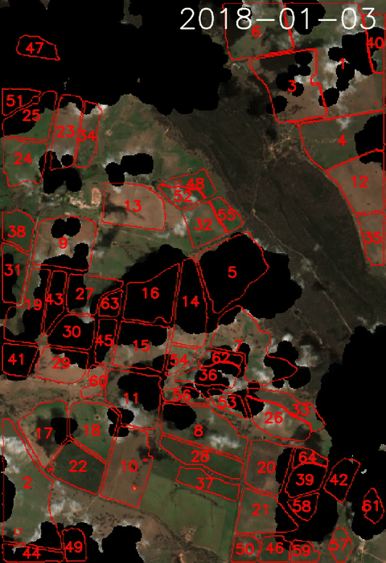
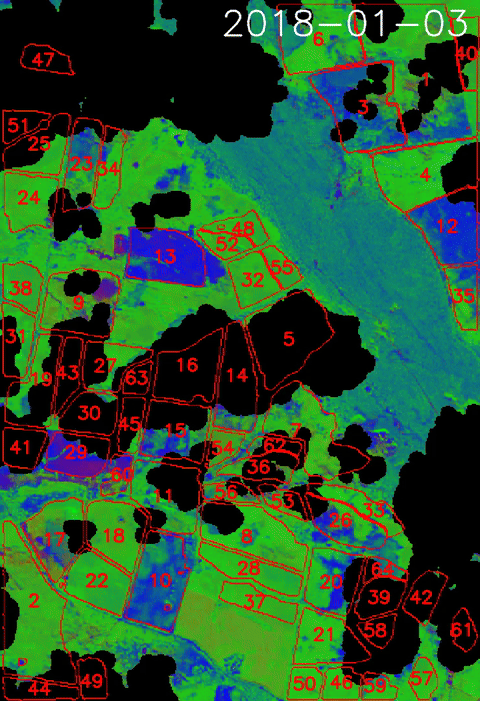
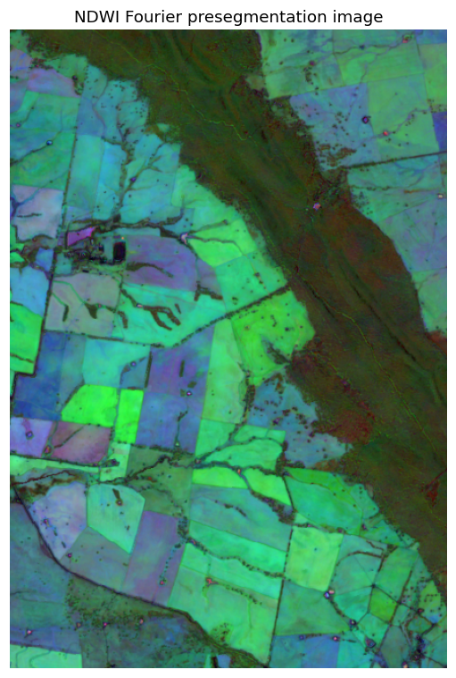
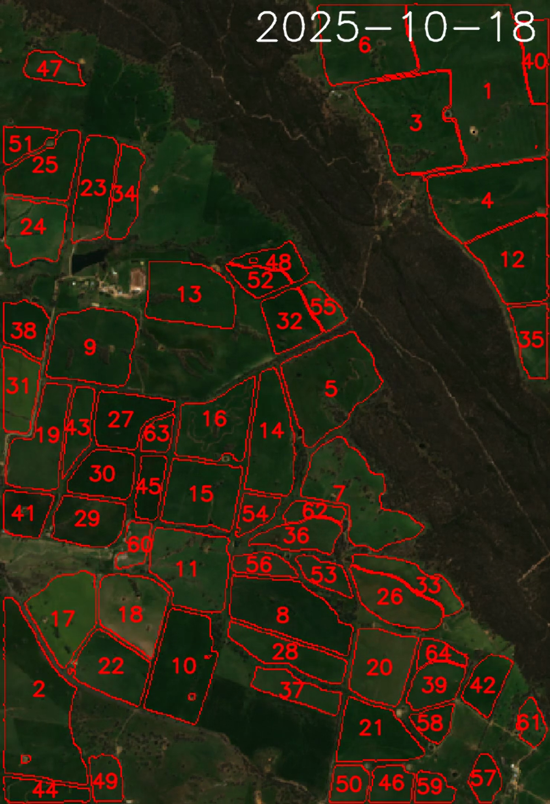
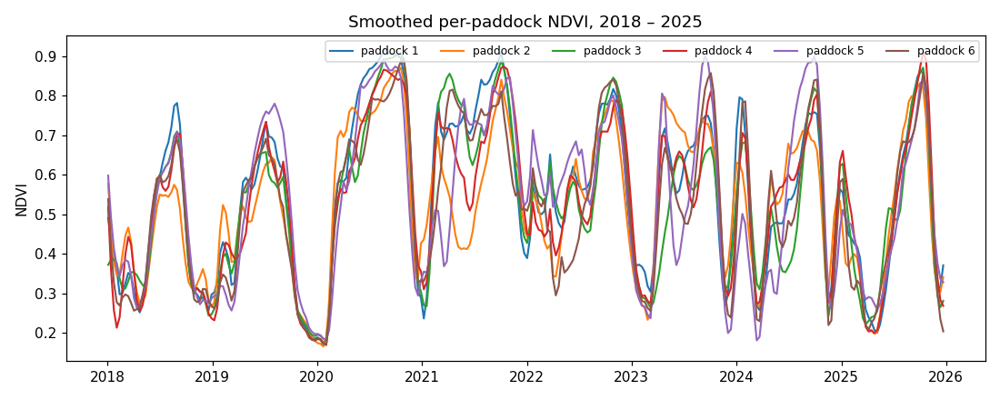
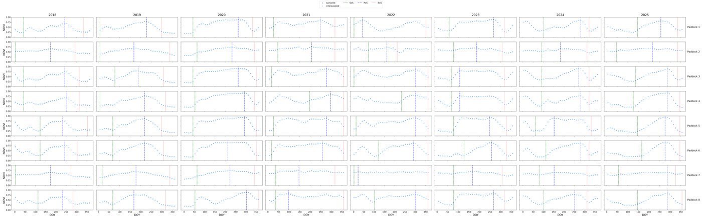
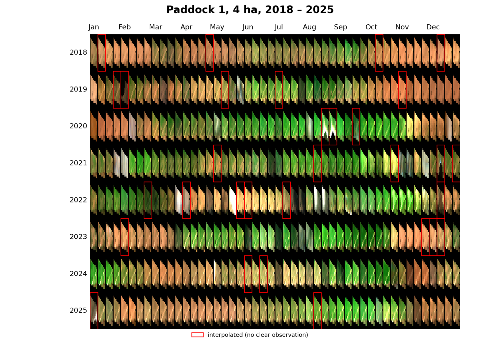
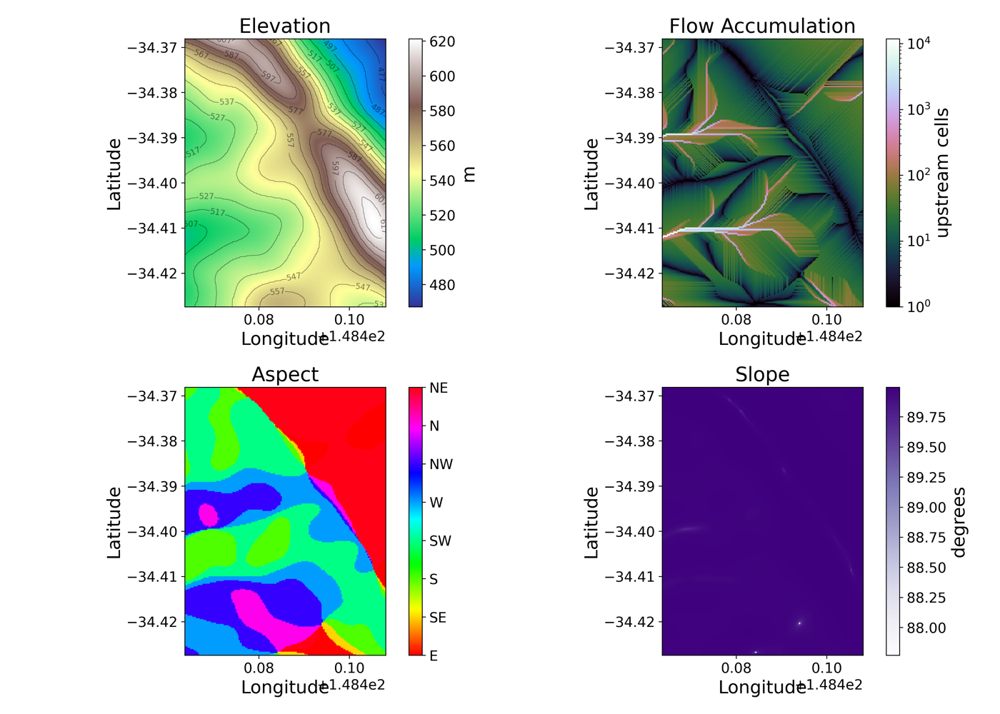
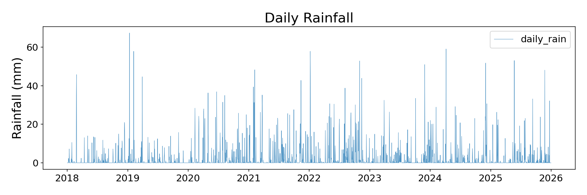

# PaddockTS

**Paddock-scale time-series analysis of Australian agricultural land,
end-to-end from a single bounding box.**

PaddockTS turns a bounding box and a date range into a complete set of
paddock-scale geospatial outputs: segmented field polygons, vegetation
indices, fractional ground-cover, per-paddock time series, seasonal
phenology metrics, and review-grade plots and videos — alongside
co-registered terrain, climate, and soil context.

Built at the [Borevitz Lab, Australian National
University](https://borevitzlab.anu.edu.au/) for ecologists, agronomists,
and remote-sensing researchers who want a reproducible path from raw
Sentinel-2 imagery to per-paddock greenness, ground cover, and
phenology.

---

## What you get

Given a `Troi` (a bounding box + date range), PaddockTS produces a
complete paddock-scale picture of the landscape. Here is eight years
of the Milgadara farm, produced by one `get_outputs(troi)` call:

<div class="grid" markdown>

<figure markdown>
  
  <figcaption>2018–2025 true-colour Sentinel-2, with 60+ automatically segmented paddocks</figcaption>
</figure>

<figure markdown>
  
  <figcaption>The same eight seasons as fractional cover — red = bare ground, green = growing, blue = dry vegetation</figcaption>
</figure>

</div>

### Paddock polygons — no digitising

Field boundaries are detected automatically: the full Sentinel-2 stack
is condensed into a single NDWI Fourier-feature image (stable
boundaries persist across seasons; transient patterns wash out), and
[Segment Anything](https://segment-anything.com/) segments it. The raw
masks are exploded, reprojected, and filtered by area and
isoperimetric compactness, leaving a clean GeoPackage with per-paddock
geometry, `area_ha`, and `compactness`. Already have boundaries from a
survey or cadastral layer? [Bring your own](#bring-your-own-paddocks)
and skip SAM entirely.

<div class="grid" markdown>

<figure markdown>
  
  <figcaption>The presegmentation image SAM sees</figcaption>
</figure>

<figure markdown>
  
  <figcaption>The filtered result over true colour</figcaption>
</figure>

</div>

### Per-paddock time series

The pivot from pixels to paddocks: for every clear acquisition, the
NaN-aware median of every Sentinel-2 band — plus NDVI, CFI, NIRv,
NDTI, and CAI, and the fractional-cover fractions — inside each
polygon, persisted as a Zarr cube on `(paddock, time)`. A resampled,
gap-filled, Savitzky-Golay-smoothed variant feeds phenology and
plotting.

<figure markdown>
  
  <figcaption>Eight seasons of smoothed NDVI for six paddocks — droughts (2018–19) and wet years (2020–22) read straight off the chart</figcaption>
</figure>

### Fractional ground cover

Every pixel of every scene unmixed into bare ground (`bg`), green
vegetation (`pv`), and non-green vegetation (`npv`) with a TFLite MLP
adapted from [`fractionalcover3`](https://github.com/jrsrp/fractionalcover3) —
the standard triple for grazing and stubble management, and the basis
of the false-colour timelines above.

### Seasonal phenology

Start, peak, and end of season (DOY and value), amplitudes,
length-of-season, integrals-under-the-curve, and an independent peak
count — per paddock, per year, via a vendored
[`phenolopy`](https://github.com/lewistrotter/phenolopy). Returned as
tidy DataFrames and written to a single CSV across all years.

<figure markdown>
  
  <figcaption>Detected season markers on the smoothed curves, one panel per year</figcaption>
</figure>

### The paddock calendar

The whole archive at a glance: one page per paddock, one row per
year, 48 thumbnail slots across the season. Cloudy gaps are
interpolated and outlined in red, so data quality is visible next to
the phenology it feeds.

<figure markdown>
  
  <figcaption>Eight seasons of one Milgadara paddock — red boxes mark interpolated (cloudy) slots</figcaption>
</figure>

### Environmental context

The same AOI, co-registered: Copernicus 30 m DEM with derived slope,
aspect, flow accumulation, and TWI;
[OzWALD](https://www.wenfo.org/ozwald/) and
[SILO](https://www.longpaddock.qld.gov.au/silo/) daily climate; and
[SLGA](https://esoil.io/TERNLandscapes/Public/Pages/SLGA/index.html)
90 m soil properties. All served from machine-wide caching stores, so
neighbouring projects never re-download.

<div class="grid" markdown>

<figure markdown>
  
  <figcaption>DEM-derived terrain panel on the Sentinel-2 grid</figcaption>
</figure>

<figure markdown>
  
  <figcaption>Daily climate diagnostics</figcaption>
</figure>

</div>

### One PDF to review it all

Everything above — topography, climate, calendars, phenology — is
stitched into a single landscape-A4 report per run, with vector text
that stays readable at any zoom.

---

## Quick example

```python
from datetime import date
from troi.troi import Troi
from PaddockTS.get_outputs import get_outputs

troi = Troi(
    bbox=[148.36265, -33.52606, 148.38265, -33.50606],
    start=date(2020, 1, 1),
    end=date(2021, 12, 31),
    stub="my_first_run",
)

get_outputs(troi)
```

This kicks off both pipelines (Sentinel-2 → PaddockTS and Environmental)
in parallel and renders a live two-column status dashboard. Outputs
land under `~/Documents/Troi-Outputs/<stub>/` (configurable). The
next `get_outputs(troi)` for the same `Troi` is a no-op — every
stage finds its cached output and skips.

---

## Bring your own paddocks

If you already have paddock boundaries from QGIS, a cadastral layer, or
a previous run, skip SAM segmentation and use them directly:

```python
from datetime import date
from troi.troi import Troi
from PaddockTS.get_outputs import get_outputs

paddocks_fp = "/path/to/my_paddocks.gpkg"  # or .geojson / .shp

troi = Troi.build_from_paddocks(
    paddocks_filepath=paddocks_fp,
    start=date(2024, 1, 1),
    end=date(2024, 12, 31),
    stub="my_farm",
    label_col="paddock_name",  # column holding human-readable names
)

get_outputs(
    troi,
    paddocks_filepath=paddocks_fp,
    skip_sam=True,
    label_col="paddock_name",
)
```

---

## Where to go next

- **[Getting started](getting-started.md)** — install, configure,
  construct a `Troi`, and run your first pipeline.
- **[Pipeline](pipeline.md)** — every stage, what it produces, what it
  reads, what it caches, and how to skip or replace any of it.
- **[API reference](api/index.md)** — full signatures and runnable
  examples for every public function.
- **[Demo notebooks](https://github.com/johnburley3000/paddocktimeseries/tree/main/demo)** —
  three runnable Jupyter notebooks: the quickstart, calling stages
  individually, and using your own paddock boundaries.

---

## License

PaddockTS is **MIT-licensed** — see [LICENSE](https://github.com/johnburley3000/paddocktimeseries/blob/main/LICENSE).

It vendors third-party code under permissive licenses (see
[`PaddockTS/LICENSES/`](https://github.com/johnburley3000/paddocktimeseries/tree/main/PaddockTS/LICENSES)):

- [`fractionalcover3`](https://github.com/jrsrp/fractionalcover3) — Robert Denham, MIT
- [`phenolopy`](https://github.com/lewistrotter/phenolopy) — Lewis Trotter, Apache 2.0
- [`DAESIM_preprocess`](https://github.com/ChristopherBradley/DAESIM_preprocess) — Christopher Bradley, MIT

If you publish work using PaddockTS, please cite the upstream data
sources (DEA Sentinel-2 ARD, Copernicus DEM, OzWALD, SILO, SLGA) and
the third-party libraries above.
