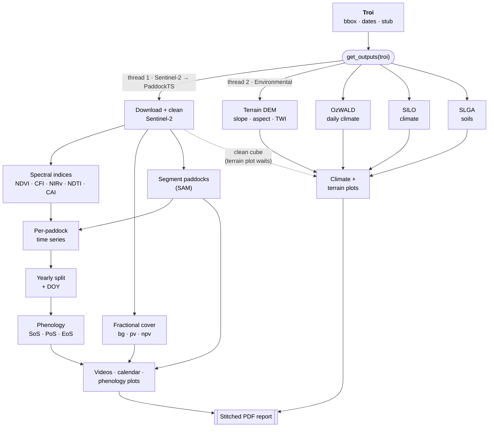

# Pipeline

PaddockTS runs two pipelines in parallel from a single `Troi`:

- **Sentinel-2 → PaddockTS** — up to 21 stages producing paddock
  segmentation, time series, phenology, plots, and a stitched PDF
  report.
- **Environmental** — 7 stages pulling terrain, climate, and soil data.

`PaddockTS.get_outputs.get_outputs(troi)` orchestrates both on two
threads with a live `rich` dashboard.



## How a stage works

Each stage is a plain Python function that:

- takes the `Troi` plus optionally a previous stage's in-memory
  output as a kwarg,
- if that kwarg is missing, loads the previous output from disk (and
  cascades — generating it first if needed),
- writes its own output to a deterministic path derived from `Troi`,
- touches a `_SUCCESS` marker **after** the data write completes; the
  marker is the cache-validity check on the next call.

This means you can call any stage in isolation, in any order, and the
caching falls into place. `get_outputs` exists purely to orchestrate
the full run with progress output — none of the stage functions
require it.

`get_outputs` also gates downstream Sentinel-2 stages on their
upstream dependencies: if SAM segmentation (stage 5) fails, the
SAM-dependent video / TS / phenology / plot stages downstream are
marked `skipped` rather than running, failing on missing inputs, and
filling the dashboard with cascading errors. See
[`get_outputs` — Cascading-skip](api/get_outputs.md#cascading-skip-for-dependent-steps).

## Sentinel-2 → PaddockTS pipeline

The driver runs each numbered stage in order. Stages marked **(SAM)**
operate on the auto-segmented SAM paddocks; stages marked **(user)**
operate on a user-provided paddocks file passed via the
`paddocks_filepath` argument to `get_outputs`. Stages are skipped if
their inputs aren't available (e.g. `skip_sam=True` skips the SAM
stages, or no `paddocks_filepath` skips the user stages).

| # | Stage | Module | Output |
|---|---|---|---|
| 1 | Sentinel-2 window (clean) | `pysentinel2.cube.Cube` | in-memory (cube-backed) |
| 2 | Spectral indices | `pysentinel2.derive` (on read) | in-memory |
| 3 | Compute fractional cover | `FractionalCover.compute_fractional_cover` | `fractional_cover.zarr` |
| 4 | Sentinel-2 video | `Plotting.sentinel2_video` | `{stub}_sentinel2.mp4` |
| 5 | Segment paddocks (SAM) | `PaddockSegmentation.get_paddocks` | `sam_paddocks.gpkg` |
| 6 | S2 + paddocks video (SAM) | `Plotting.sentinel2_paddocks_video` | `..._sentinel2_paddocks.mp4` |
| 7 | S2 + paddocks video (user) | `Plotting.sentinel2_paddocks_video` | `..._sentinel2_paddocks.mp4` |
| 8 | Fractional cover video | `Plotting.fractional_cover_video` | `{stub}_fractional_cover.mp4` |
| 9 | FC + paddocks video (SAM) | `Plotting.fractional_cover_paddocks_video` | `..._fractional_cover_paddocks.mp4` |
| 10 | FC + paddocks video (user) | `Plotting.fractional_cover_paddocks_video` | `..._fractional_cover_paddocks.mp4` |
| 11 | Make paddock TS (SAM) | `Phenology.make_paddock_time_series` | `..._timeseries.zarr` |
| 12 | Make paddock TS (user) | `Phenology.make_paddock_time_series` | `..._timeseries.zarr` |
| 13 | Make yearly paddock TS (SAM) | `Phenology.make_yearly_paddock_time_series` | `..._timeseries_<year>.zarr` |
| 14 | Make yearly paddock TS (user) | `Phenology.make_yearly_paddock_time_series` | `..._timeseries_<year>.zarr` |
| 15 | Estimate phenology (SAM) | `Phenology.estimate_phenology` | `{year: DataFrame}` in-memory |
| 16 | Estimate phenology (user) | `Phenology.estimate_phenology` | `{year: DataFrame}` in-memory |
| 17 | Calendar plot (SAM) | `Plotting.calendar_plot` | `..._calendar_<year>_p01.png` (PNG) + vector pages in the PDF report |
| 18 | Calendar plot (user) | `Plotting.calendar_plot` | `..._calendar_<year>_p01.png` (PNG) + vector pages in the PDF report |
| 19 | Phenology plot (SAM) | `Plotting.phenology_plot` | `..._phenology_p01.png` |
| 20 | Phenology plot (user) | `Plotting.phenology_plot` | `..._phenology_p01.png` |
| 21 | PDF report | `Plotting.make_pdf` | `{stub}.pdf` |

### Stage 1: Sentinel-2 window (via the pysentinel2 cube)

Sentinel-2 comes from the machine-wide
[`pysentinel2`](https://github.com/thestochasticman/pysentinel2) cube:
`Cube.get_ds_troi(troi, clean=True)` downloads only the pixels no
previous read has fetched (coverage is tracked per day as exact pixel
rectangles), then applies cloud masking **on read**. Cleaning dilates the fmask cloud/shadow (and snow) mask by
`buffer_px` to catch cloud-edge halos, and gates frames on
`max_cloud_fraction` (contamination over *valid* pixels) and
`min_valid_fraction` (swath coverage) — per-frame `cloud_fraction` /
`valid_fraction` land as coordinates on the returned dataset. See the
pysentinel2 README's *Cleaning & masking* section for the full design.

Failure modes specific to DEA's STAC are documented in pysentinel2's
[`diagnostics.md`](https://github.com/thestochasticman/pysentinel2/blob/main/diagnostics.md).

### Stage 5: Paddock segmentation (SAM)


*Automatically segmented paddocks over the true-colour Sentinel-2 window.*

Three internal steps:

1. **Presegmentation** (`_presegment`) — derives a single grayscale
   image from the multi-temporal Sentinel-2 stack using NDWI Fourier
   features. This collapses time into a representation that emphasises
   stable field boundaries and suppresses transient noise (clouds,
   shadows, seasonal greenness). Written as a GeoTIFF at
   `Paths(troi).preseg`.
2. **SAM mask generation** — feeds the presegmented image to
   [`segment-geospatial`](https://samgeo.gishub.org/) (default
   backbone: SAM ViT-H, ~2.4 GB checkpoint auto-downloaded to
   `{config.tmp_dir}/sam_weights` on first run) and writes a mask
   GeoTIFF plus raw polygons GeoPackage.
3. **Vectorisation and filtering** — explodes multipart geometries,
   reprojects to a local UTM zone for accurate area / perimeter,
   computes `area_ha` and isoperimetric `compactness = 4πA/L²`, drops
   polygons outside `[min_area_ha, max_area_ha]` or below
   `min_compactness`, sorts by area descending, and assigns 1-based
   `paddock` IDs.

The final filtered GeoPackage lives at `Paths(troi).sam_paddocks`.

### Stages 11–14: Per-paddock time series

`make_paddock_time_series` is the pivot from pixel-space to
paddock-space. It:

1. Computes the five spectral indices transiently, one at a time
   (never materialised for the whole window — they are on-read
   derivatives from `pysentinel2.derive`).
2. Rasterises paddock polygons onto the Sentinel-2 grid using integer
   IDs.
3. For every data variable, in parallel across processes, computes the
   per-paddock NaN-aware median across pixels at every timestep.
4. Stitches the results into an `xarray.Dataset` on dims
   `(paddock, time)` and persists as Zarr v2.

`make_yearly_paddock_time_series` then splits the cube by calendar year
and attaches a `doy` (day-of-year, 1–366) coordinate, so seasonal
curves from different years align on a common DOY axis.


*One page per paddock: each cell is the paddock's true-colour thumbnail
at that point in the season. Red outlines mark fully interpolated slots;
orange outlines mark observations whose cloud-masked pixels were gap-filled.*

### Stages 15–16: Phenology

`estimate_phenology` wraps the vendored
[`phenolopy`](https://github.com/lewistrotter/phenolopy) library. For
each year and each paddock, it computes:

- `sos_times` / `sos_values` — start of season
- `pos_times` / `pos_values` — peak of season
- `eos_times` / `eos_values` — end of season
- amplitudes, length-of-season, integrals over season
- `num_peaks` — independent count of identified seasons

Paddocks with fewer than `min_observations` (default 25) valid points
in a year are skipped for that year. The result is one tidy
`pandas.DataFrame` per year, returned as `{year: DataFrame}`.


*Smoothed NDVI with detected start / peak / end of season, per paddock per year.*

## Environmental data pipeline

Environmental data comes from the machine-wide store packages —
each caches downloads across every troi on the machine, so
overlapping regions and repeat runs re-fetch nothing:

| # | Stage | Store / module | Output |
|---|---|---|---|
| 1 | Download terrain (Copernicus DEM) | [`pycopdem`](https://github.com/thestochasticman/pycopdem) | elevation window (machine-wide store) |
| 2 | Download OzWALD daily | [`pyozwald`](https://github.com/thestochasticman/pyozwald) | daily meteorology (machine-wide store) |
| 3 | Download SILO climate | [`pysilo`](https://github.com/thestochasticman/pysilo) | daily climate (machine-wide store) |
| 4 | Download SLGA soils | [`pyslga`](https://github.com/thestochasticman/pyslga) | soil properties (machine-wide store) |
| 5 | DAESim forcing | `PaddockTS.daesim_forcing` | `{stub}_DAESim_forcing.csv` |
| 6 | OzWALD plot | `Plotting.ozwald_plot` | `{stub}_ozwald_daily_*.png` |
| 7 | SILO plot | `Plotting.silo_plot` | `{stub}_silo_*.png` |
| 8 | Terrain plot | `Plotting.terrain_tiles_plot` | `{stub}_topography.png` |

The terrain plot reprojects onto the Sentinel-2 pixel grid, which it
reconstructs deterministically from the troi bbox — it does not wait
on (or read) the Sentinel-2 data itself.

The SILO stages are **silently skipped** (status: `skipped`, not
`error`) if `config.email` is unset; the SLGA stage is skipped the
same way if `config.tern_api_key` is unset. Terrain and OzWALD work
without any credentials.


*Elevation, flow accumulation, aspect, and slope derived from the
Copernicus DEM, reprojected onto the Sentinel-2 grid.*


*OzWALD daily climate diagnostic (one of several panels).*

## Skipping the dashboard

If you want one stage and don't need the live UI, call it directly —
nothing requires `get_outputs`:

```python
from PaddockTS.PaddockSegmentation.get_paddocks import get_paddocks
gdf = get_paddocks(troi)
```

The function loads (and if necessary downloads) its own inputs from
the cache.

## See also

- **[API reference](api/index.md)** — full function signatures with
  runnable examples
- [`PaddockTS.get_outputs`](api/get_outputs.md) — the orchestrator
- [`diagnostics.md`](https://github.com/johnburley3000/paddocktimeseries/blob/main/diagnostics.md)
  — known failure modes (DEA STAC cold-start, GDAL HTTP auth)
